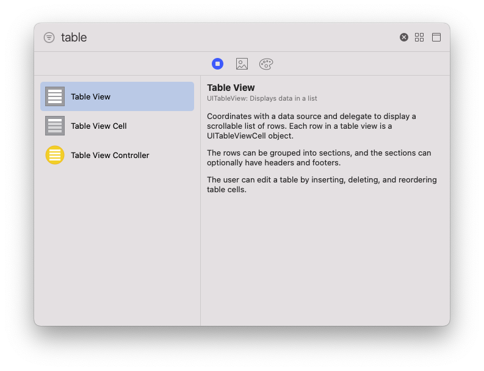
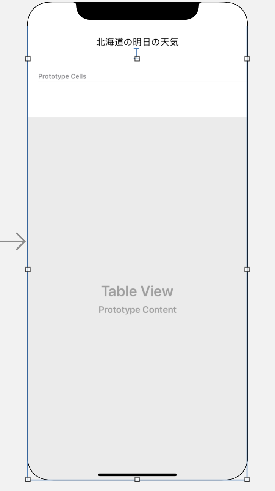
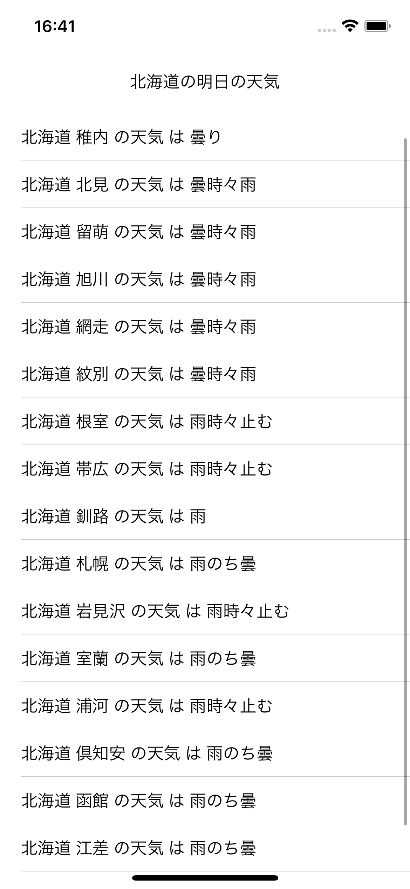

Swiftの通信用のライブラリAlamofireを使って、簡単な天気一覧表示アプリを作成します。

北海道のさまざまな地点の明日の天気を一覧で確認できるようにします。

## Alamofireの導入

AlamofireをCocoaPodsを仕様してインストールします。

Xcodeで作成したプロジェクトのディレクトリで`pod init`を実行すると、`Podfile`が生成されます。
```
cd <プロジェクトのディレクトリ>
pod init
```
`Podfile`を開いて、target`pod "Alamofire"`と追加します。
```
# Uncomment the next line to define a global platform for your project
# platform :ios, '9.0'

target '<プロジェクトの名前>' do
	pod "Alamofire"
end
```
追加したライブラリをインストールします。
```
pod install
```
`pod install`終了後は、`<プロジェクトの名前>.xcodeproj`ではなく、新たに生成されている`<プロジェクトの名前>.xcworkspace`からXcodeを開く必要があります。

## Alamofireの使い方

天気予報 API（livedoor 天気互換）を利用します。
https://weather.tsukumijima.net

レスポンスをデコードする`struct`を指定してAPIのURLを入れるだけで、API通信からレスポンスのデコードまで一気にやってくれます。

例えば、これだけで久留米の今日明日明後日の3日間の天気が取れます。

```swift
import Alamofire

struct ForecastResponse: Decodable {
    // 天気のタイトル(例: "福岡県 久留米 の天気")
    let title: String
    // 今日明日明後日の3日間の天気が配列で入る。
    let forecasts: [Forecast]
    
    struct Forecast: Decodable {
        // 日付(yyyy-MM-dd)
        let date: String
        // 天気(例: "曇のち一時雨")
        let telop: String
    }
}

func getForecastAPI() {
    AF.request("https://weather.tsukumijima.net/api/forecast/city/400040").responseDecodable(of: ForecastResponse.self) { response in
        // 通信終了後の処理
        print(response)
    }
}
```
`struct`は、API仕様書のレスポンスフィールドやJSONデータサンプルを参考に、階層構造を崩さず欲しい情報の部分だけ切り出して作れば、よしなに取ってきてくれます。

クロージャの引数になっている`response`は`DataResponse<ForecastResponse, AFError>`という型になっており、エラーの情報も含まれています。

`response.result`を調べることで、通信成功と失敗を分岐して成功時にデコードデータを取り出すことができます。

```swift
AF.request("https://weather.tsukumijima.net/api/forecast/city/400040").responseDecodable(of: ForecastResponse.self) { response in
    switch response.result {
    case .success(let forecastResponse):
        // 通信成功時の処理
        print(forecastResponse)
    case .failure(let error):
        // 通信失敗時の処理
        print(error)
    }
}
```

次は、このデータをiOSアプリでリストを表示することができるTableViewに流し込んで画面に表示してみます。

今回は、北海道のさまざまな地点の明日の天気を一覧で表示したいので、urlの`city/***`を変更して何度かAPIを取得します。

## 画面の作成

画面の作成にはStoryboardを使用します。

とは言っても、`TableView`を乗っけるだけです。

`Main`というStoryboardファイルを開き、右上の+ボタンからTableViewと検索し、`Table View`を画面の上に乗っけます。



その後、`Table View Cell`も同様に`Table View`の上に1つ乗っけておきます。

あとはお好みでラベルをつけたりサイズを調整したりしてください。




## コード

`ViewController`を書いていきます。

便宜上`DispatchQueueViewController`にしていますが、Main Storyboardの画面を動かすだけなら`ViewController`に置き換えてください。

```swift
import Foundation
import UIKit
import Alamofire

struct ForecastResponse: Decodable {
    let title: String
    let forecasts: [Forecast]
    
    struct Forecast: Decodable {
        let date: String
        let telop: String
    }
}

class DispatchQueueViewController: UIViewController {
    
    @IBOutlet weak var tableView: UITableView!
    var forecastStrings: [String] = []
    
    override func viewDidLoad() {
        super.viewDidLoad()
        // 北海道の各地点の地点ID(https://weather.tsukumijima.net/primary_area.xml)
        let cityIDs: [String] = ["011000", "012010", "012020", "013010", "013020", "013030", "014010", "014020", "014030", "015010", "015020", "016010", "016020", "016030", "017010", "017020"]
        getForecastAPIs(cityIDs: cityIDs)
    }
    
    func getForecastAPIs(cityIDs: [String]) {
        cityIDs.forEach ( { cityID in
            getForecastAPI(cityID: cityID) { forecastResponse in
                // forecasts配列は基本的に[今日, 明日, 明後日]と入っているので、[1]を指定することで明日の天気を取得している。
                self.forecastStrings.append(forecastResponse.title + " は " + forecastResponse.forecasts[1].telop)
                self.tableView.dataSource = self
                self.tableView.reloadData()
            }
        })
    }
    
    func getForecastAPI(cityID: String, completion: @escaping ((ForecastResponse) -> Void)) {
        let url = "https://weather.tsukumijima.net/api/forecast/city/\(cityID)"
        AF.request(url).responseDecodable(of: ForecastResponse.self) { response in
            switch response.result {
            case .success(let forecastResponse):
                completion(forecastResponse)
                print(forecastResponse)
            case .failure(let error):
                print(error)
            }
        }
    }
}

// UITableViewを表示するために`UITableViewDataSource`プロトコルに定められたメソッド2つ
extension DispatchQueueViewController: UITableViewDataSource {
    func tableView(_ tableView: UITableView, numberOfRowsInSection section: Int) -> Int {
        return forecastStrings.count
    }
    
    func tableView(_ tableView: UITableView, cellForRowAt indexPath: IndexPath) -> UITableViewCell {
        let cell = tableView.dequeueReusableCell(withIdentifier: "cell", for: indexPath)
        cell.textLabel!.text =  forecastStrings[indexPath.row]
        return cell
    }
}
```

`@IBOutlet weak var tableView: UITableView!`をStoryboardの`Table View`に紐つけることを忘れずに。

完成すると、北海道の明日の天気が一覧で表示されます。


