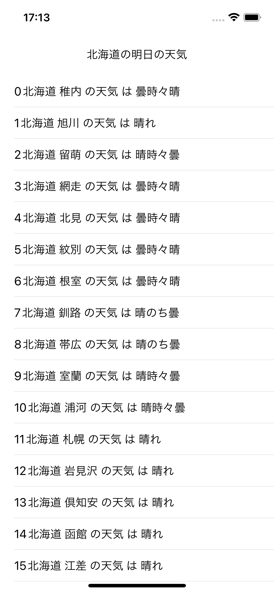

## 非同期な処理を処理を同期的に実行したい

AlamofireでAPI取得をすると、基本的に非同期的に処理が行われます。

API通信をしている間、画面が止まってしまったり次の処理が止まったりしてしまうと不便なので、普通は非同期的に動いてくれた方が嬉しいのですが、それが不便なこともあります。

例えば、連続でAPIを呼ぶ時です。

以前作ったAlamofireで複数地点の天気を取得してリストにするアプリでは、地点ごとに異なるURLにアクセスしなければいけないので、連続でAPIを呼んでいます。

https://seanwakasugi.github.io/posts/alamofiretutorial/

このアプリでは連続で非同期にAPIを呼び、API通信が完了したら表示用のリストに書き込むようにしています。

実際どのように処理されているのか、API通信に番号を振って確認してみます。

```swift
func getForecastAPIs(cityIDs: [String]) {
    cityIDs.enumerated().forEach ( { (index, cityID) in
        getForecastAPI(cityID: cityID) { forecastResponse in
            // indexで最初に読んだAPIから0, 1, 2...と番号を振ってAPIを呼び出す
            self.forecastStrings.append(String(index) + forecastResponse.title + " は " + forecastResponse.forecasts[1].telop)
            self.tableView.dataSource = self
            self.tableView.reloadData()
        }
    })
}
```


0, 3, 2, 4とバラバラにAPIが返ってきているのが分かります。

順番にAPIを呼ぶために、APIを非同期的ではなく同期的に呼びたいと思います。

`DispatchQueue`を使って実現します。

## DispatchQueue & DispatchGroup

DispatchQueueを使うと、指定したスレッドでキューを実行してくれます。

iOSでは、UIの処理が走るmainスレッドと別にglobalスレッドが用意されています。

globalスレッドで通信処理などを動かしたい時は、下のように括ります。
```swift
let dispatchQueue = DispatchQueue.global()
dispatchQueue.async {
    // globalキュー
}
```

さらにDispatchGroupを使うことで、非同期処理をグループにしてグループにした処理が終わるまで待つことができます。

```swift
let dispatchQueue = DispatchQueue.global()
let dispatchGroup = DispatchGroup()
dispatchQueue.async {
    dispatchGroup.enter()
    // 非同期処理1
    dispatchGroup.leave()

    // 非同期処理が終わるまで待ち
    dispatchGroup.wait()
    // 非同期処理の後に行う処理
}
```

## 天気APIを同期的に呼ぶ

`DispatchQueue`&`DispatchGroup`を使って、天気がバラバラではなく順番に表示されるようなコードを書いていきます。

1. 天気APIを呼ぶ
2. APIを呼んでデータを書き込む処理が終わるまで待つ
3. 終わったのを確認してから次の天気APIを呼ぶ
4. その繰り返し

```swift
func getForecastAPIs(cityIDs: [String], completion: @escaping (() -> Void)) {
    let dispatchQueue = DispatchQueue.global()
    let dispatchGroup = DispatchGroup()
    dispatchQueue.async {
        // globalキュー
        cityIDs.enumerated().forEach ( { (index, cityID) in
            dispatchGroup.enter()
            self.getForecastAPI(cityID: cityID) { forecastResponse in
                // mainキュー(Alamofireの仕様)
                self.forecastStrings.append(String(index) + forecastResponse.title + " は " + forecastResponse.forecasts[0].telop)
                dispatchGroup.leave()
            }
            // globalキュー
            dispatchGroup.wait()
        })
        // globalキュー
        DispatchQueue.main.async {
            // mainキュー(画面を触るのでmainである必要がある)
            self.tableView.dataSource = self
            self.tableView.reloadData()
        }
    }
}
```

AlamofireでAPIを呼んでいるメソッド`getForecastAPI()`を呼ぶ前に`dispatchGroup.enter()`をしています。

`getForecastAPI()`実行後に呼ばれるcompletionに`dispatchGroup.leave()`を書いています。

APIを呼ぶループ内の最後に`dispatchGroup.wait()`をしています。

`enter()`が呼ばれた後API周りの処理が終わって`leave()`が呼ばれるまで、次のループへ進むことができなくなっています。

これにより、同期的にAPIが呼ばれて順番が崩れることなく表示されます。



例えば、`wait()`の位置をループの外に出すとどうなるでしょうか。

```swift
func getForecastAPIs(cityIDs: [String], completion: @escaping (() -> Void)) {
    let dispatchQueue = DispatchQueue.global()
    let dispatchGroup = DispatchGroup()
    dispatchQueue.async {
        // globalキュー
        cityIDs.enumerated().forEach ( { (index, cityID) in
            dispatchGroup.enter()
            self.getForecastAPI(cityID: cityID) { forecastResponse in
                // mainキュー(Alamofireの仕様)
                self.forecastStrings.append(String(index) + forecastResponse.title + " は " + forecastResponse.forecasts[0].telop)
                dispatchGroup.leave()
            }
        })
        // globalキュー
        dispatchGroup.wait()
        DispatchQueue.main.async {
            // mainキュー(画面を触るのでmainである必要がある)
            self.tableView.dataSource = self
            self.tableView.reloadData()
        }
    }
}
```

こうすると、APIはまたバラバラに呼ばれます。

APIを読んだ後waitしていないからです。

ただ、今回はループが終わった後にwaitしているので、`dispatchGroup`に`enter()`した全ての処理が`leave()`するまで`wait()`します。

つまり、全部APIを呼び終わって、画面を表示する準備が終った後にその下の処理が動きます。

今回は全部APIを呼び終わった後に`tableView`の更新をするという動きになります。（つまり、正常に表示されます。）


## `DispatchQueue.async(group:)`がAlamofireで使えない理由

`DispatchGroup`の一般的な使い方として以下のような書き方があります。

```swift
let dispatchQueue = DispatchQueue.global()
let dispatchGroup = DispatchGroup()
dispatchQueue.async(group: dispatchGroup) {
    // 非同期処理
}

// 非同期処理が終わるまで待ち
dispatchGroup.wait()
// 非同期処理の後に行う処理
```

`enter()`や`leave()`よりシンプルで書きやすいのですが、Alamofireでは使えませんでした。

これを使って書いても、普通は`wait()`してくれずに次の処理へ進んでしまうと思います。

理由は(恐らく)、Alamofireでは内部で複数のスレッドを使用してAPI通信を行なっているからです。

Alamofireの内部では、リクエスト作成、通信、レスポンスのデコード、completion等々（処理の区切りかたはあくまでイメージですが）様々な処理が行われています。

高速化のためにそれぞれの処理を別スレッドで行なっていると考えられます。

例えば`global()`スレッドでAlamofireのスレッドを呼び出しても、リクエスト作成は`スレッド1(仮称)`、通信は`スレッド2`、デコードは`スレッド3`、completionは`main`スレッドみたいなイメージです。

そのため、`global()`スレッドで`dispatchGroup`で括っても、`global()`での処理の終了を待つだけで他のスレッドでの処理の終了は感知できていません。

処理が終わったことを知るためには、処理を終わった時に行うcompletion内に`leave()`を書く必要があるのです。


## コード全文

```swift
import Foundation
import UIKit
import Alamofire

struct ForecastResponse: Decodable {
    let title: String
    let forecasts: [Forecast]
    
    struct Forecast: Decodable {
        let date: String
        let telop: String
    }
}

class DispatchQueueViewController: UIViewController {
    
    @IBOutlet weak var tableView: UITableView!
    var forecastStrings: [String] = []
    
    override func viewDidLoad() {
        super.viewDidLoad()
        let cityIDs: [String] = ["011000", "012010", "012020", "013010", "013020", "013030", "014010", "014020", "014030", "015010", "015020", "016010", "016020", "016030", "017010", "017020"]
        getForecastAPIs(cityIDs: cityIDs) {
            self.tableView.dataSource = self
            self.tableView.reloadData()
        }
        
    }
    
    func getForecastAPIs(cityIDs: [String], completion: @escaping (() -> Void)) {
        let dispatchQueue = DispatchQueue.global()
        let dispatchGroup = DispatchGroup()
        dispatchQueue.async {
            // globalキュー
            cityIDs.enumerated().forEach ( { (index, cityID) in
                dispatchGroup.enter()
                self.getForecastAPI(cityID: cityID) { forecastResponse in
                    // mainキュー
                    self.forecastStrings.append(String(index) + forecastResponse.title + " は " + forecastResponse.forecasts[0].telop)
                    dispatchGroup.leave()
                }
                // globalキュー
                dispatchGroup.wait()
            })
            // globalキュー
            DispatchQueue.main.async {
                // mainキュー(画面を触るのでmainである必要がある)
                completion()
            }
        }
    }
    
    func getForecastAPI(cityID: String, completion: @escaping ((ForecastResponse) -> Void)) {
        // globalキュー
        AF.request("https://weather.tsukumijima.net/api/forecast/city/\(cityID)").responseDecodable(of: ForecastResponse.self, decoder: JSONDecoder()) { forecastResponse in
            // mainキュー(Alamofireの仕様)
            switch forecastResponse.result {
            case .success(let response):
                completion(response)
                print(response)
            case .failure(let error):
                print(error)
            }
        }
    }
}

extension DispatchQueueViewController: UITableViewDataSource {
    func tableView(_ tableView: UITableView, numberOfRowsInSection section: Int) -> Int {
        return forecastStrings.count
    }
    
    func tableView(_ tableView: UITableView, cellForRowAt indexPath: IndexPath) -> UITableViewCell {
        let cell = tableView.dequeueReusableCell(withIdentifier: "cell", for: indexPath)
        cell.textLabel!.text =  forecastStrings[indexPath.row]
        return cell
    }
}

```