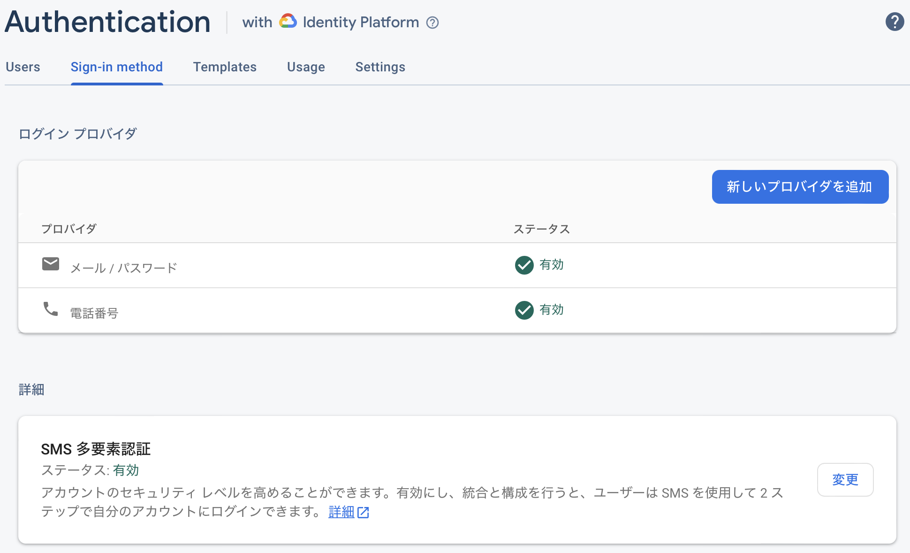

Firebase Authenticationの多要素認証の有効化の仕方と動作まとめです。

## Firebaseコンソール側の作業

メール+パスワードでログインし、多要素認証にSMSを使う形になります。

FirebaseのAuthenticationのコンソールのSign-in methodを設定します。

ログインプロバイダで`メール/パスワード`と`電話番号`を有効化し、SMS多要素認証を有効にします。



電話番号を有効化したりSMS多要素認証をオンにしても、既存のメールとパスワードでログインしていたユーザに（観測範囲内での）影響はありませんでした。

## iOSアプリの準備

実装は公式や基本的なメソッドをasync/awaitで書き直した以下の記事を参考にして下さい。

[Firebase公式のガイド](https://firebase.google.com/docs/auth/ios/multi-factor?hl=ja)

[async/awaitで書いた多要素認証実装例](https://seanwakasugi.github.io/posts/firebaseauthconcurrency/)

コード以外の部分で必要になるのは、サイレントプッシュの設定とreCAPTCHAの設定です。

reCAPTCHAの設定は必須、サイレントプッシュの設定もなるべくした方がいいです。（サイレントプッシュの設定をしないと毎回SMS送信前に10秒強の待ち時間が発生します）

Firebase多要素認証では、SMSの送信リクエストが（ロボットではなく）アプリからのものであることを確認するために、サイレントプッシュを使います。

初回SMS送信前にFirebaseが端末にサイレントプッシュを送信し、端末は自動で受信を確認して認証してくれます。

iOSシミュレータなどサイレントプッシュが使用できない場合は、reCAPTCHAを利用して自動で確認されます。場合によっては画像を選択して人間であることを確認されます。

Androidではこの準備が必要無いようです。

### サイレントプッシュの設定

1. iOSプロジェクトの通知を有効にします。

2. FirebaseにAPNキーを登録します。

Firebaseコンソールのプロジェクト設定、CloudMessagingのiOSアプリの項で`APNs 認証キー`か`APNs 証明書`を登録します。`APNs 認証キー`が推奨のようですが、`APNs 証明書`でも動きます。

3. ユーザに通知の許可を求めます。サイレント通知なので、通知が許可されない場合でも機能するはずです(要確認)が、少なくとも`application.registerForRemoteNotifications()`を書かないと機能しないようです(要確認)。

```swift
class AppDelegate: UIResponder, UIApplicationDelegate {
       func application(_ application: UIApplication, didFinishLaunchingWithOptions launchOptions: [UIApplication.LaunchOptionsKey: Any]?) -> Bool {
        FirebaseApp.configure()
        setRemoteNotification(application: application)
        return true
    }
}

extension AppDelegate: UNUserNotificationCenterDelegate {
    func setRemoteNotification(application: UIApplication) {
        UNUserNotificationCenter.current().delegate = self
        let authOptions: UNAuthorizationOptions = [.alert, .badge, .sound]
        UNUserNotificationCenter.current().requestAuthorization(options: authOptions, completionHandler: {_, _ in })
        application.registerForRemoteNotifications()
    }
}
```

### reCAPTCHAの設定

前述のサイレントプッシュを設定していても、reCAPTCHAの設定をすることをおすすめします。

サイレントプッシュに失敗しタイムアウト(5秒?)した場合にreCAPTCHAが使われるからです。

1. プロジェクト設定 → TARGETのアプリ名 → Info → URL Types

2. URL Schemesに`GoogleService-Info.plist`の`REVERSED_CLIENT_ID`を入れる


## 既存のメール/パスワード認証に追加実装が必要な点

Firebaseコンソールで多要素認証をオンにしても全ユーザーの多要素認証が必須になるわけでは無いので、全員必須としたい場合はアプリ側での実装が必要になります。

詳しい実装方法は以下を見て下さい。

[Firebase公式のガイド](https://firebase.google.com/docs/auth/ios/multi-factor?hl=ja)

[async/awaitで書いた多要素認証実装例](https://seanwakasugi.github.io/posts/firebaseauthconcurrency/)

### 新規登録

変更なし。

iOSだと`Auth.auth().createUser(withEmail: , password: )`

多要素認証は新規登録後に別途メソッドを呼ぶ必要があります。

### ログイン

多要素認証が設定されていないアカウントは変更なし。

多要素認証が設定されているアカウントは、サインインメソッドを呼んだ後にエラーが返ってくるので、その後SMS認証コードを入力させる必要があります。

iOSだと`Auth.auth().signIn(withEmail: , password: )`

### ログアウト

変更なし。

iOSだと`Auth.auth().signOut()`

### メールアドレス変更

呼ぶメソッドが変わり、変更確定後に強制ログアウトされるようになります。

また、直近の認証(15分?)が必要なので、このメソッドを呼ぶ前にログイン+SMS認証コード確認をしなくてはいけません。

詳しくは以下。

[多要素認証のメアド変更仕様](https://seanwakasugi.github.io/posts/firebaseauthconcurrency2/)

### パスワード変更

変更なしですが、直近の認証(15分?)が必要なので、このメソッドを呼ぶ前にログイン+SMS認証コード確認をしなくてはいけません。

iOSだと`Auth.auth().currentUser?.updatePassword(to: )`

### アカウント削除

変更なしですが、直近の認証(15分?)が必要なので、このメソッドを呼ぶ前にログイン+SMS認証コード確認をしなくてはいけません。

iOSだと`Auth.auth().currentUser?.delete()`

### パスワードを忘れた(パスワードリセット)

変更なし。

iOSだと`Auth.auth().sendPasswordReset(withEmail: )`

メールアドレスにパスワードリセット用のリンクが送信されますが、リンク先でも多要素認証は必要ありません。