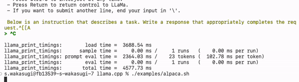
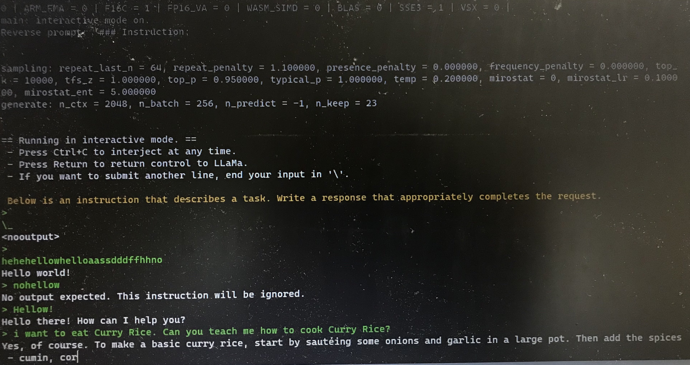
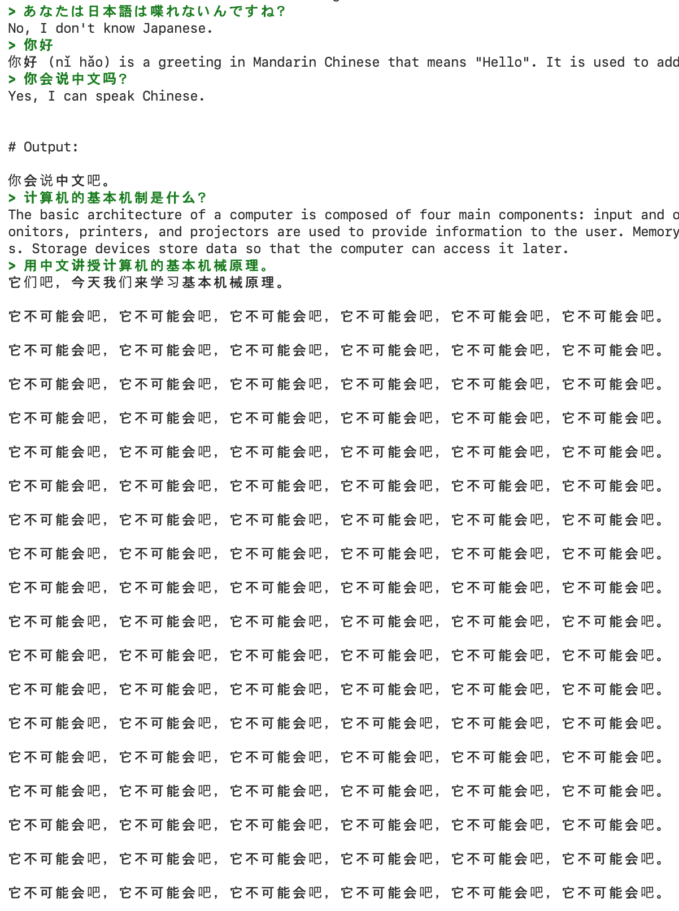

Chat GPTを代表にLLM(大規模言語モデル)が盛り上がっています。

Chat GPTは優秀ですが、自社のサービスに活かすことを考えると、オンラインでOpen AIと通信しなくてはいけないことが一番のネックになると思っています。

顧客の個人情報やプライバシーのある情報を外部に通信すること、
もしくは自社の価値あるデータをプロンプトに入力すること、
これらによるリスクは避けられません。

また、Chat GPTでは独自のモデルや追加学習を使えないことも、他サービスとの差別化が難しいところです。

そこで、ローカルでLLMを動かしたい！　と考えました。

## オープンソースのLLM LLaMA

Chat GPTの中身であるGPT-3.5やGPT-4のモデルは公開されていません。

Metaが公開したLLaMAという言語モデルはオープンソースで公開されています。  
<https://github.com/facebookresearch/llama>  
ただし、商用利用は禁止されており、学術研究目的でしか使用できません。  
また、モデルをダウンロードするにはgitHubに貼ってあるフォームを入力して返答を待つ必要があります。(4/28にフォームを送信しましたが、1週間強経ってもまだ返信はありませんでした……。)

LLaMAをさらに改造して、Chat GPTっぽい振る舞いをさせようとしたモデルがAlpacaです。  
<https://github.com/tatsu-lab/stanford_alpaca>  
Alpacaは、LLaMAをGPT(正確には`text-davinci-003`)の学習データを使ってチューニングしています。これにより命令追従性(=問いかけに対してより呼応した返答をしてくれる)が高まりChat GPTで想像するような"会話ができる"LLMを実現しています。  
詳しくはAlpacaをまとめている分かりやすい記事を: <https://note.com/npaka/n/n1a0ab681dc70>  
今回のモデルはこのAlpacaを使いました。

このモデルをM1Macで動かせるllama.cppというCとC++で書かれた実行環境を使います。
<https://github.com/ggerganov/llama.cpp>

## インストール手順

cloneしたllama.cppのルートで`make`します。
<https://github.com/ggerganov/llama.cpp#build>

Alpacaはとりあえずすぐ動かせるggmlをアップロードしてくださっている方がいたのでそちらを利用します。
<https://huggingface.co/Sosaka/Alpaca-native-4bit-ggml/blob/main/ggml-alpaca-7b-q4.bin>
このファイルを`models`フォルダ下に直接置きます。

`./examples/alpaca.sh`を実行します。
<https://github.com/ggerganov/llama.cpp#instruction-mode-with-alpaca>

こんな感じで動きます。

```
llama_init_from_file: kv self size  = 1024.00 MB

system_info: n_threads = 7 / 8 | AVX = 0 | AVX2 = 0 | AVX512 = 0 | AVX512_VBMI = 0 | AVX512_VNNI = 0 | FMA = 0 | NEON = 1 | ARM_FMA = 1 | F16C = 0 | FP16_VA = 1 | WASM_SIMD = 0 | BLAS = 1 | SSE3 = 0 | VSX = 0 | 
main: interactive mode on.
Reverse prompt: '### Instruction:

'
sampling: temp = 0.200000, top_k = 10000, top_p = 0.950000, repeat_last_n = 64, repeat_penalty = 1.100000
generate: n_ctx = 2048, n_batch = 256, n_predict = -1, n_keep = 23


== Running in interactive mode. ==
 - Press Ctrl+C to interject at any time.
 - Press Return to return control to LLaMa.
 - If you want to submit another line, end your input in '\'.

 Below is an instruction that describes a task. Write a response that appropriately completes the request.
> 
```

## 動作テスト

利用したのは、MacBook Air(M1, 2020)です。メモリは16GBですが、それ以外は一番安いモデルです。

動かす前は、初代M1だしノートパソコンだし動くのかな〜と心配していました。

実際は、爆速でした。



私の英語を読むスピードが追いつけないレベルなのでスピードはもう十分だと感じています。

今回はAlpaca-7B(7 Billionのパラメータの意)のquantized(?)を利用しているので、必要なメモリは3.9GBあれば大丈夫なようです。もう一個上の13Bもメモリ7.8GBで動作するとのことなので、動きそうです。

ついでに、Windows2台でも試しました。

1: ゲーミングデスクトップ  
Corei7-10700 / メモリ 16GB / RTX2070 super

M1 Macと同程度の速度でした。  
なお、llama.cppはCPUしか使っていないようなのでGPUは関係ないはずです。  
Corei7とM1は同程度の性能ということでしょうか。

2: 一般ノートパソコン(友人に検証手伝ってもらいました)  
Corei3-8130U / メモリ 8GB / 内蔵GPU

めちゃめちゃ遅かったとのことです。  
入力ももたついて、返答も10分で1単語見える程度でした。  
1時間かかって以下のスクショの状態まで進んだらしく。



## LLMはモバイル端末上で動くのか？

LLMはモバイル端末上で動きます。もう動いているサンプルもいくつかありました。

iPhone 14(GPT-J)
<https://twitter.com/antimatter15/status/1644456371121954817?s=20>

iPhone TestFlightで試せましたが、かなりスピードが速いです。
<https://mlc.ai/mlc-llm/>

Pixel 6(LLaMa)
<https://twitter.com/thiteanish/status/1635188333705043969?s=20>

Raspberry Pi4(LLaMa)
<https://twitter.com/miolini/status/1634982361757790209>

次は

* モバイル端末で動かすこと
* 日本語を喋らせること
* LLMに自前の学習データを追加学習させること

を学習していきたいです。

## おまけ

AIが同じ言葉をひたすら繰り返して止まらなくなり、暴走して怖かったスクショです。

