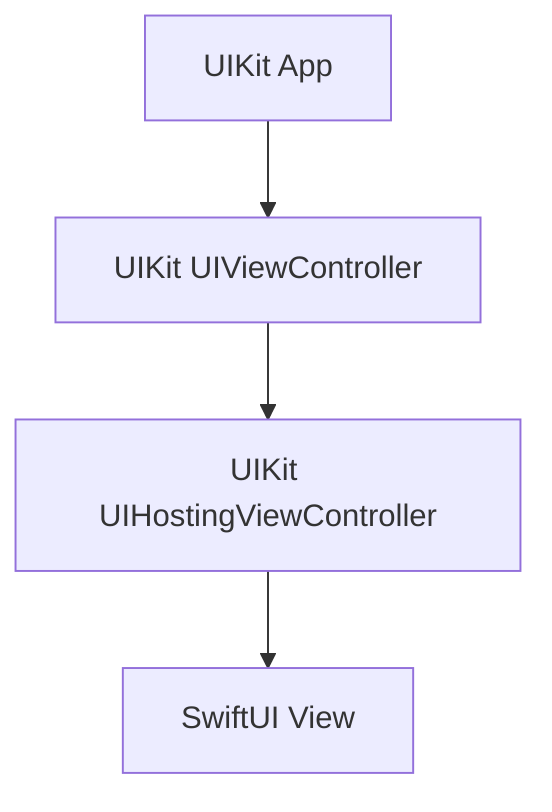
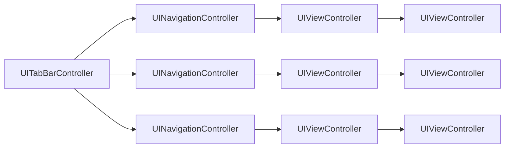
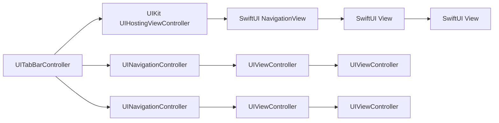
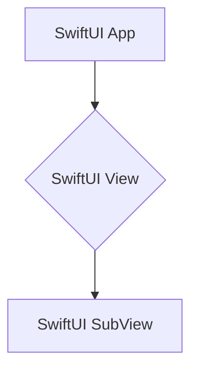

Appleとしては、iOSアプリはSwiftUIに移行していく流れのようです。
UIKitも引き続きサポートされていますが、ウィジェットなどSwiftUIでしか書けないようなケースも増えてきており、既存アプリも徐々にSwiftUIに移行し始めても良さそうです。

ただ、アプリ内でSwiftUIとUIKitが混ざる場合はどこまでSwiftUI、どこまでUIKitと明確に線引きをしないと、SwiftUIとUIKitの橋渡しだけでコードが煩雑になってしまいます。
以下、SwiftUIとUIKitの線引きとして考えられるケースとSwiftUIとUIKitのシンプルな橋渡しの方法を書いていきます。

## ケース1: 1画面だけのモーダルをSwiftUIで作成する

UIViewControllerからSwiftUIで書いたモーダルを呼び出して表示するだけのシンプルな場合です。



重要なのは、Viewから呼び出し元のUIViewControllerを参照したり、UIViewController側からViewのメソッドを呼んだりしないようにすることです。
UINavigationControllerを参照してpush/popすることも、複雑になるので避けたほうが良いです。
Navigationを使いたい場合は、ケース2を参考にNavigationごとSwiftUIに移行するほうが簡単です。

既存のUIViewControllerから以下のようにモーダルで呼ぶのが一番楽な実装です。

```swift
let privacy = UIHostingController(rootView: PrivacyView())
present(privacy, animated: true)
```

閉じるボタンを実装したい場合は、SwiftUI側で以下のように呼ぶだけです。

iOS 14以下をサポートする場合

```swift
    @Environment(\.presentationMode) private var presentationMode
    var body: some View {
        Button {
            presentationMode.wrappedValue.dismiss()
        } label {
            Image(systemName: "xmark")
        }
    }
```

iOS 15以上のみのサポートの場合

```swift
    @Environment(\.dismiss) private var dismiss
        var body: some View {
        Button {
            dismiss()
        } label {
            Image(systemName: "xmark")
        }
    }
```

UIViewController側を触らずとも、SwiftUI側でdismiss()することで、UIHostingControllerがdismiss()してくれます。

## ケース2: 1NavigationだけSwiftUIで作成する

1つのUINavigationControllerとその下で遷移するUIViewController群を、SwiftUIに置き換える方法です。

例えばこのようにUITabBarControllerがビューのルートにあり、各タブにUINavigationControllerがセットされて、タブ内だけで遷移していくようなアプリがあるとします。



この中で、UINavigationController1つと、その下のUIViewControllerをSwiftUIに置き換えるとします。



```swift
class PrivacyViewController: UIHostingController<PrivacyView> {
    init() {
        super.init(rootView: PrivacyView())
    }

    // PrivacyViewControllerがStoryboardからインスタンス化されるなら必要
    required init?(coder aDecoder: NSCoder) {
        super.init(coder: aDecoder, rootView: PrivacyView())
    }
}
```

この場合、UIKitのビューコントローラをUIViewControllerRepresentableを使ってSwiftUIと互換性のある形にラップします。ナビゲーションフローはSwiftUIを使いますが、具体的な画面の実装はUIKitを使い続けます。

## ケース3: SwiftUIでアプリを作り直す

アプリの全体をSwiftUIで書き直す選択肢もあります。この場合、全てのビューコントローラやビューがSwiftUIのものに置き換わります。



ここでは、アプリ全体がSwiftUIで書かれています。これは一番きれいな方法ですが、全てを一度に書き換えるのは時間と労力がかかるため、大規模なアプリではこの方法を選ぶのは難しいかもしれません。

## 対応OSバージョンについて

SwiftUIは発展途上で、使えるメソッドが違ったり、同じメソッドでも仕様が大きく変わることがあります。
iOS14~サポートのアプリで開発する機会があったので、iOS14以降でバージョンごとに大きく変わることを書いておきます。

### iOS15

プルリフレッシュ `.refreshable` が使えます。

[refreshable(action:) | Apple Developer Documentation](https://developer.apple.com/documentation/swiftui/view/refreshable(action:))

プルリフレッシュ特有のインタラクションはUIKit+SwiftUIで再現するのが難しいので、これ以前ではプルリフレッシュできないと考えた方が良いです。

### iOS16

`NavigationStack` が使えます。

[Migrating to new navigation types | Apple Developer Documentation](https://developer.apple.com/documentation/swiftui/migrating-to-new-navigation-types)

`NavigationView` はiOS17までサポートのはずですが、画面遷移が起こるボタンを同時押しするとナビゲーションバーがおかしくなって、元の画面に戻れない状態になるなど致命的な問題があります。iOS15未満をサポートする場合以下のようなメソッドを利用することを推奨します。

```swift
@ViewBuilder
func NavigationStackOrView<Content: View>(@ViewBuilder content: () -> Content) -> some View {
    if #available(iOS 16.0, *) {
        NavigationStack {
            content()
        }
    } else {
        NavigationView {
            content()
        }
    }
}
```

### iOS17

Swift Macrosが扱えるようになり、コードをシンプルに書くうえで大きな進化があります。

`@Observable` が使えます。

[Managing model data in your app | Apple Developer Documentation](https://developer.apple.com/documentation/swiftui/managing-model-data-in-your-app)

`#Preview` が使えます。

[Previews in Xcode | Apple Developer Documentation](https://developer.apple.com/documentation/swiftui/previews-in-xcode)
