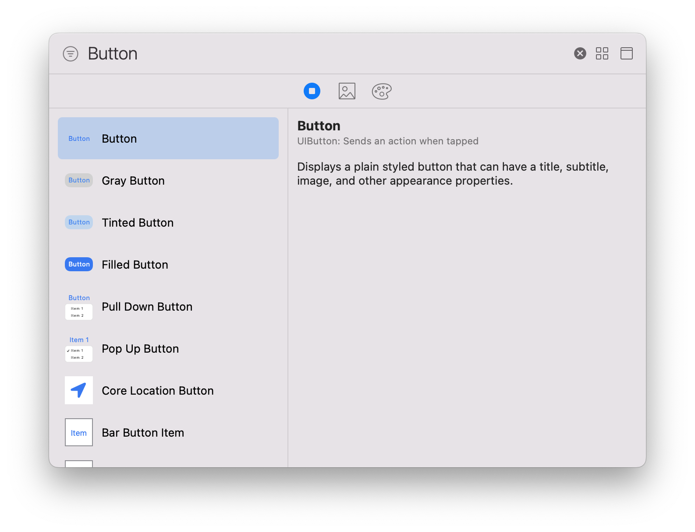
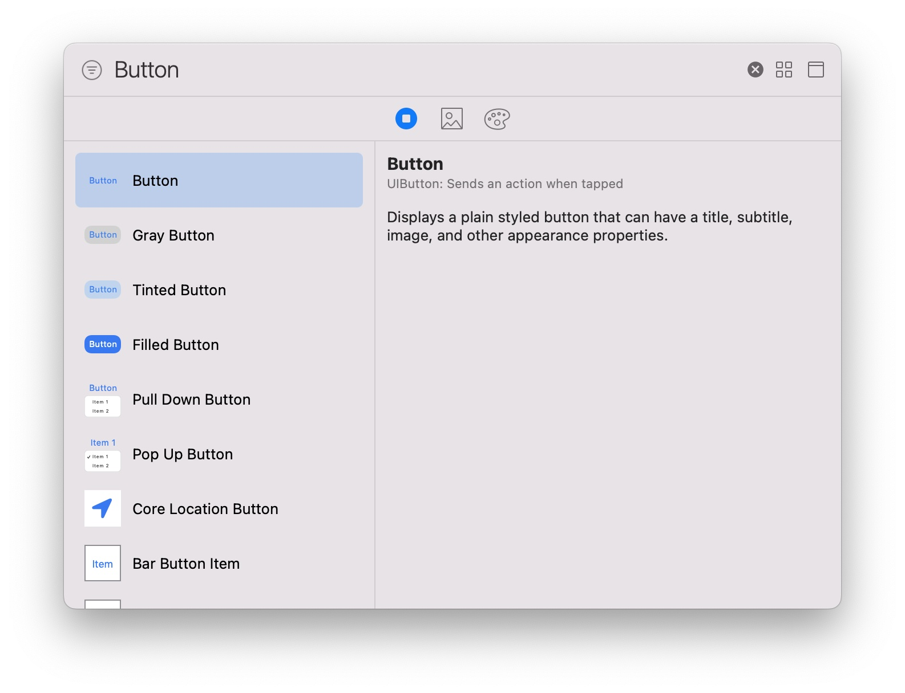

Storyboard上でボタンを設置しようとすると、以下のような選択肢がある。







これらと同じものをコードで実装しようとすると少しずつ違うものができがちである。

StroyboardのデフォルトはAppleの推奨であると(私は)考えているので、Storyboardのデフォルトボタンをコードで実装しながらAppleの推奨のボタンの実装方法について考えたい。

### UIButtonのstyle