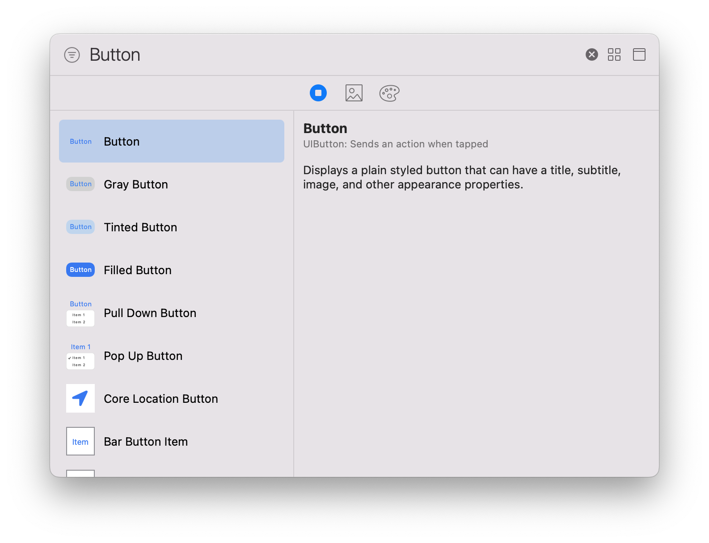
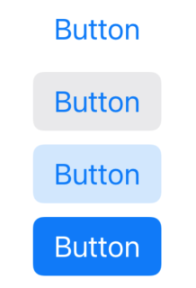
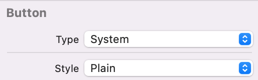
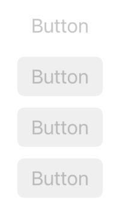
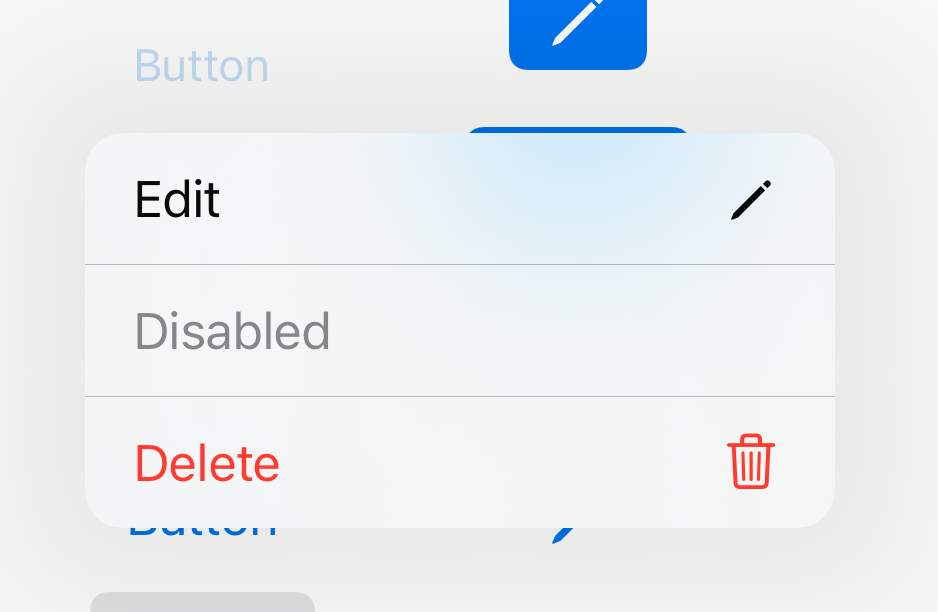
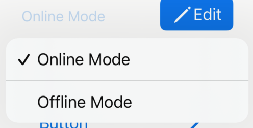
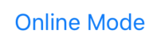
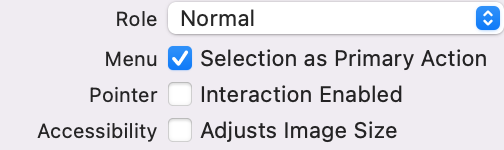

Storyboard上でボタンを設置しようとすると、以下のような選択肢がある。



これらと同じものをコードで実装しようとすると少しずつ違うものができがちである。

StroyboardのデフォルトはAppleの推奨であると(私は)考えているので、Storyboardのデフォルトボタンをコードで実装しながら、Appleの推奨のボタンの実装方法とは何か考えたい。

### UIButtonのstyleについて

選択肢のうち、次の4つは`Style`の違いによるものである.

* Button
* Gray Button
* Tinted Button
* Filled Button




Storyboard上はButtonのStyle部分が変化しているだけである。

* Button - `plain`
* Gray Button - `gray`
* Tinted Button - `tinted`
* Filled Button - `filled`




コードでは、`configuration`を書き換えることで同じ設定が行える。
```
let button = UIButton(type: .system)
let grayButton = UIButton(type: .system)
let tintedButton = UIButton(type: .system)
let filledButton = UIButton(type: .system)

button.configuration = UIButton.Configuration.plain()
grayButton.configuration = UIButton.Configuration.gray()
tintedButton.configuration = UIButton.Configuration.tinted()
filledButton.configuration = UIButton.Configuration.filled()
```

これらの使い分けについて、Appleの公式ガイドラインでは、

>Use a filled button for the most likely action in a view.

もっとも選択される可能性が高いボタンは`Filled Button`にしましょう。

>Use style — not size — to visually distinguish the preferred choice among multiple options.

好ましい選択肢を強調するにはボタンの大きさではなく、`Style`を使いましょう。

https://developer.apple.com/design/human-interface-guidelines/components/menus-and-actions/buttons

とのことである。

なお、使用できないようにグレーアウトしたボタン等を実装するときは、`Style`や色などをいじらなくても、ボタン自体を`isEnabled`で使用できなくするだけでそのStyleの使用できないボタンが表示される。
(なお、定義時に`let button = UIButton(type: .system)`のように`type`を`system`にする必要がある。)
```
button.configuration = UIButton.Configuration.plain()
button.isEnabled = false
grayButton.configuration = UIButton.Configuration.gray()
grayButton.isEnabled = false
tintedButton.configuration = UIButton.Configuration.tinted()
tintedButton.isEnabled = false
filledButton.configuration = UIButton.Configuration.filled()
filledButton.isEnabled = false
```



### アイコンのついたボタン

Storyboardで選択できるボタンのうち残り2つはiOS14から使用できるようになったボタンを押すと選択肢が出てくるボタンである。
* Pull Down Button
* Pop Up Button



Pull Down Buttonは、ボタンの名前は固定だが、

Pop Up Buttonは、選択するとボタンの名前が選択した要素の名前になる。





このように、ポップアップボタンは選んだ`Online Mode`という名前のボタンに変化する。


別の言い方をすると、プルダウンボタンは選択したら終わりだが、

ポップアップボタンは何度も状態を変えたりするようにできている。

Apple公式ガイドラインでは、Pop-upとPull-downの使いわけについて

>Use a pop-up button to present a flat list of mutually exclusive options or states. A pop-up button helps people make a choice that affects their content or the surrounding view. Use a pull-down button instead if you need to:
> * Offer a list of actions
> * Let people select multiple items
> * Include a submenu

Pop-upは、排他的な（どちらかしか選べない）選択肢や状態を選ぶ時に使う。

Pull-downは、以下のような時に使う。
* アクションを提示するとき
* 複数項目が選択できるとき
* サブメニューがあるとき

https://developer.apple.com/design/human-interface-guidelines/components/menus-and-actions/pop-up-buttons

と示されている。

明確な使い分けがあるが、実装の上ではたった1つのパラメータを変えるだけである。


`Selection as Primary Action`にチェックが入っていれば`Pop-up`、入っていなければ`Pull-down`として機能する。

コードでも、以下のように書き分ける。
```
popUpButton.changesSelectionAsPrimaryAction = true
```

実際の実装は以下である。

```
let pullDownButton = UIButton(type: .system)

let items = UIMenu(children: [
        // titleで文字、imageで右側に表示される画像、handlerでタップした時の動作を記述できる。
        UIAction(title: "Edit", image: UIImage(systemName: "pencil"), handler: { _ in print("Edit is tapped")}),
        // attributes: .disabledで押せなくなり、グレーアウトする。
        UIAction(title: "Disabled", attributes: .disabled, handler: { _ in print("Disabled is tapped")}),
        // attributes: .hiddenは表示されない。
        UIAction(title: "Hidden", attributes: .hidden, handler: { _ in print("Hidden is tapped")}),
        // attributes: .destructicve(破壊的操作)は赤く表示される。
        UIAction(title: "Delete", image: UIImage(systemName: "trash"), attributes: .destructive, handler: { _ in print("Delete is tapped")})
    ])

pullDownButton.menu = items
// defaultはfalseで、ボタン長押しでメニューが開く。trueだとボタンタップでメニューが開く。
pullDownButton.showsMenuAsPrimaryAction = true
```

```
let popUpButton = UIButton(type: .system)

let items = UIMenu(children: [
    UIAction(title: "Online Mode", handler: { _ in print("Online mode")}),
    UIAction(title: "Offline Mode", handler: { _ in print("Offline mode")})
])

popUpButton.menu = items
// defaultはfalseで、ボタン長押しでメニューが開く。trueだとボタンタップでメニューが開く。
popUpButton.showsMenuAsPrimaryAction = true
// defaultはfalseで、Pull-down。trueだとPop-up。
popUpButton.changesSelectionAsPrimaryAction = true
```

これは、`.menu`が入っているだけのただのボタンなので、前述の`Style`をいじって見た目を変えたりもできる。