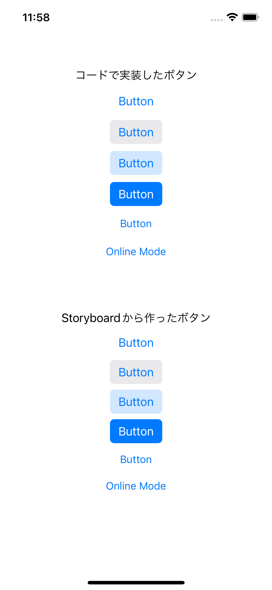

Storyboard上でボタンを設置しようとすると、以下のような選択肢があります。


これらと同じものをコードで実装しました。

StroyboardのデフォルトはAppleの推奨であると(私は)考えているので、Storyboardのデフォルトボタンをコードで実装しながら、Appleの推奨のボタンの実装方法について考えていきます。

### UIButtonのStyle

選択肢のうち、次の4つは`Style`の違いによるものです。

* Button
* Gray Button
* Tinted Button
* Filled Button


Storyboardで設置してみると、ButtonのStyle部分が変化しているだけなのがわかります。

* Button - `plain`
* Gray Button - `gray`
* Tinted Button - `tinted`
* Filled Button - `filled`


コードでは、`configuration`を書き換えることで同じ設定が行えます。
```
let button = UIButton(type: .system)
let grayButton = UIButton(type: .system)
let tintedButton = UIButton(type: .system)
let filledButton = UIButton(type: .system)

button.configuration = UIButton.Configuration.plain()
grayButton.configuration = UIButton.Configuration.gray()
tintedButton.configuration = UIButton.Configuration.tinted()
filledButton.configuration = UIButton.Configuration.filled()
```

これらの使い分けについて、Appleの公式ガイドラインでは、以下のように書かれています。

>Use a filled button for the most likely action in a view.

もっとも選択される可能性が高いボタンは`Filled Button`にしましょう。

>Use style — not size — to visually distinguish the preferred choice among multiple options.

好ましい選択肢を強調するにはボタンの大きさではなく、`Style`を使いましょう。

https://developer.apple.com/design/human-interface-guidelines/components/menus-and-actions/buttons


なお、使用できないようにグレーアウトしたボタン等を実装したいときは、`Style`や色などをいじらなくても、ボタン自体を`isEnabled`で使用できなくするだけでそのStyleの使用できないボタンが表示されます。
(なお、定義時に`let button = UIButton(type: .system)`のように`type`を`system`にする必要があります。)
```
button.configuration = UIButton.Configuration.plain()
button.isEnabled = false
grayButton.configuration = UIButton.Configuration.gray()
grayButton.isEnabled = false
tintedButton.configuration = UIButton.Configuration.tinted()
tintedButton.isEnabled = false
filledButton.configuration = UIButton.Configuration.filled()
filledButton.isEnabled = false
```


### メニューのついたボタン

Storyboardで選択できるボタンのうち残り2つはiOS14から使用できるようになったボタンを押すと選択肢が出てくるボタンです。
* Pull Down Button
* Pop Up Button


Pull Down Buttonは、ボタンの名前は固定ですが、

Pop Up Buttonは、選択するとボタンの名前が選択した要素の名前になります。


このように、Pop Up Buttonは選んだ`Online Mode`という名前のボタンに変化します。


別の言い方をすると、プルダウンボタンは選択したら終わりですが、  
ポップアップボタンは何度も状態を変えたりするようにできています。

Apple公式ガイドラインでは、Pop-upとPull-downの使いわけについて、以下のように書かれています。

>Use a pop-up button to present a flat list of mutually exclusive options or states. A pop-up button helps people make a choice that affects their content or the surrounding view. Use a pull-down button instead if you need to:
> * Offer a list of actions
> * Let people select multiple items
> * Include a submenu

Pop-upは、排他的な（どちらかしか選べない）選択肢や状態を選ぶ時に使う。

Pull-downは、以下のような時に使う。
* アクションを提示するとき
* 複数項目が選択できるとき
* サブメニューがあるとき

https://developer.apple.com/design/human-interface-guidelines/components/menus-and-actions/pop-up-buttons


このように明確な使い分けが決められていますが、実装の上ではたった1つのパラメータを変えるだけです。


`Selection as Primary Action`にチェックが入っていれば`Pop-up`、入っていなければ`Pull-down`として機能します。

コードでも、以下のように書き分けます。
```
popUpButton.changesSelectionAsPrimaryAction = true
```

実際の実装は以下です。

```
let pullDownButton = UIButton(type: .system)

let items = UIMenu(children: [
        // titleで文字、imageで右側に表示される画像、handlerでタップした時の動作を記述できる。
        UIAction(title: "Edit", image: UIImage(systemName: "pencil"), handler: { _ in print("Edit is tapped")}),
        // attributes: .disabledで押せなくなり、グレーアウトする。
        UIAction(title: "Disabled", attributes: .disabled, handler: { _ in print("Disabled is tapped")}),
        // attributes: .hiddenは表示されない。
        UIAction(title: "Hidden", attributes: .hidden, handler: { _ in print("Hidden is tapped")}),
        // attributes: .destructicve(破壊的操作)は赤く表示される。
        UIAction(title: "Delete", image: UIImage(systemName: "trash"), attributes: .destructive, handler: { _ in print("Delete is tapped")})
    ])

pullDownButton.menu = items
// defaultはfalseで、ボタン長押しでメニューが開く。trueだとボタンタップでメニューが開く。
pullDownButton.showsMenuAsPrimaryAction = true
```

```
let popUpButton = UIButton(type: .system)

let items = UIMenu(children: [
    UIAction(title: "Online Mode", handler: { _ in print("Online mode")}),
    UIAction(title: "Offline Mode", handler: { _ in print("Offline mode")})
])

popUpButton.menu = items
// defaultはfalseで、ボタン長押しでメニューが開く。trueだとボタンタップでメニューが開く。
popUpButton.showsMenuAsPrimaryAction = true
// defaultはfalseで、Pull-down。trueだとPop-up。
popUpButton.changesSelectionAsPrimaryAction = true
```

これは、`.menu`が入っているだけのただのボタンなので、前述の`Style`をいじって見た目を変えたりもできます。

### 全体コード

Storyboardで作った下の6つのボタンと同じものをコードで実装しました。



```
import UIKit

class ViewController: UIViewController {
    
    let label = UILabel()
    let plainButton = UIButton(type: .system)
    let grayButton = UIButton(type: .system)
    let tintedButton = UIButton(type: .system)
    let filledButton = UIButton(type: .system)
    let pullDownButton = UIButton(type: .system)
    let popUpButton = UIButton(type: .system)

    let stackView = UIStackView()
    
    @IBOutlet weak var sbPullDownButton: UIButton!
    @IBOutlet weak var sbPopUpButton: UIButton!
    
    override func viewDidLoad() {
        super.viewDidLoad()
        view.addSubview(stackView)
        stackView.translatesAutoresizingMaskIntoConstraints = false
        stackView.axis = .vertical
        stackView.alignment = .center
        stackView.spacing = 10
        stackView.topAnchor.constraint(equalTo: view.safeAreaLayoutGuide.topAnchor, constant: 50).isActive = true
        stackView.centerXAnchor.constraint(equalTo: view.safeAreaLayoutGuide.centerXAnchor).isActive = true

        label.text = "コードで実装したボタン"
        stackView.addArrangedSubview(label)
        
        plainButton.configuration = UIButton.Configuration.plain()
        grayButton.configuration = UIButton.Configuration.gray()
        tintedButton.configuration = UIButton.Configuration.tinted()
        filledButton.configuration = UIButton.Configuration.filled()
        
        addButton(uiButton: plainButton)
        addButton(uiButton: grayButton)
        addButton(uiButton: tintedButton)
        addButton(uiButton: filledButton)

        addPullDownButton(pullDownButton: pullDownButton)
        addPopUpButton(popUpButton: popUpButton)

        // StoryboardのPullDown/PopUpボタンにもメニュー設定
        setPullDownMenu(pullDownButton: sbPullDownButton)
        setPopUpMenu(popUpButton: sbPopUpButton)
        
    }
    
    func addButton(uiButton: UIButton) {
        stackView.addArrangedSubview(uiButton)
        uiButton.setTitle("Button", for: .normal)
    }
    
    
    func addPullDownButton(pullDownButton: UIButton) {
        setPullDownMenu(pullDownButton: pullDownButton)
        pullDownButton.showsMenuAsPrimaryAction = true
        pullDownButton.setTitle("Button", for: .normal)
        stackView.addArrangedSubview(pullDownButton)
    }
    
    func setPullDownMenu(pullDownButton: UIButton) {
        let items = UIMenu(children: [
            UIAction(title: "Edit", image: UIImage(systemName: "pencil"), handler: { _ in print("Edit is tapped")}),
            UIAction(title: "Disabled", attributes: .disabled, handler: { _ in print("Disabled is tapped")}),
            UIAction(title: "Hidden", attributes: .hidden, handler: { _ in print("Hidden is tapped")}),
            UIAction(title: "Delete", image: UIImage(systemName: "trash"), attributes: .destructive, handler: { _ in print("Delete is tapped")})
        ])
        pullDownButton.menu = items
    }
    
    func addPopUpButton(popUpButton: UIButton) {
        setPopUpMenu(popUpButton: popUpButton)
        popUpButton.showsMenuAsPrimaryAction = true
        popUpButton.changesSelectionAsPrimaryAction = true
        stackView.addArrangedSubview(popUpButton)
    }
    
    func setPopUpMenu(popUpButton: UIButton) {
        let items = UIMenu(children: [
            UIAction(title: "Online Mode", handler: { _ in print("Online mode")}),
            UIAction(title: "Offline Mode", handler: { _ in print("Offline mode")})
        ])
        popUpButton.menu = items
    }
}
```