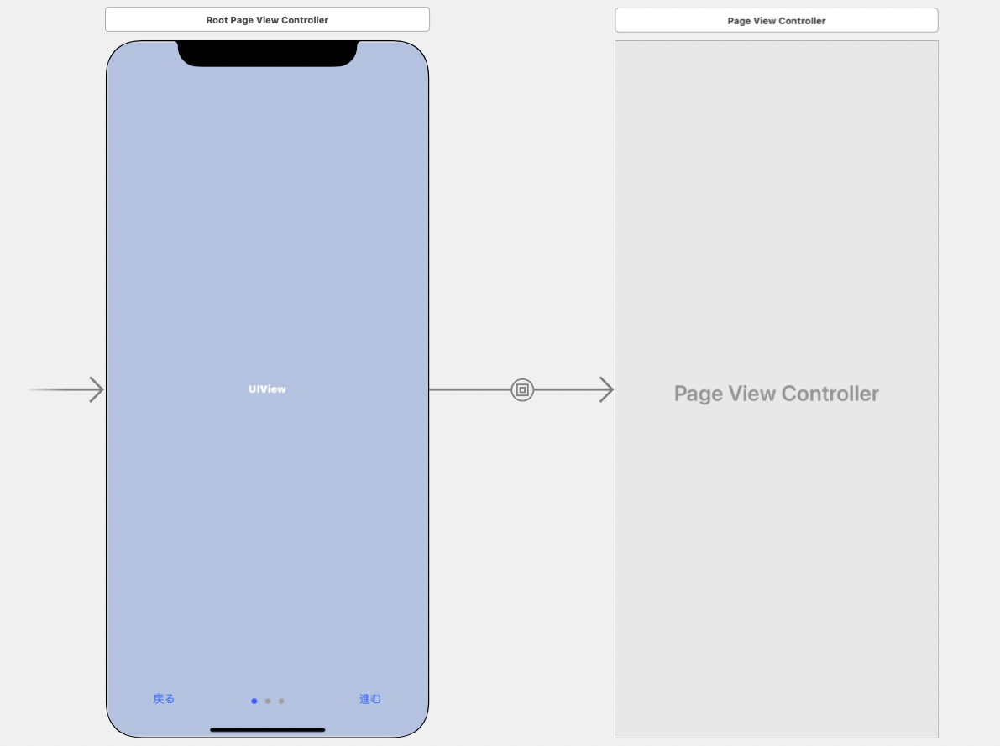

`UIPageViewController`を使って、スワイプでの遷移に加えてボタンでの戻る/進むを追加したところ、いろいろとつまづいたのでどのように解決したかメモを残しておきます。

コードが見たい方はこちら、もしくは記事最下部に全文載せています。
https://github.com/SeanWakasugi/SwipeAndButtonPageView

作りたかったアプリはこのようなものです。
* とりあえず3ページの画面を行き来できる
* スワイプで遷移できる
* ボタンでも遷移できる
* 現在のページをドットで表示
* ページが増えてもコードを変えずに対応できる

作っていく中でつまづいた点は以下の5つです。
* どこにボタンを置けばいい？
* ボタンで遷移するコードの書き方は？
* 現在のページ数の取得方法は？
* ボタンでの遷移中にスワイプ操作をすると遷移先がずれる
* スワイプ中にボタン操作をするとアプリが落ちる

まず、`UIPageViewController`の一番簡単な使い方から、上の5つの疑問をどのように解消したか解説していきます。
### UIPageViewControllerの最小構成

Storyboardで、このpageViewControllerをclassに設定したUIPageViewControllerを置いて、isInitialに設定する必要があります。

```swift
import UIKit

class pageViewController: UIPageViewController {

    var controllers: [UIViewController] = []
    
    override func viewDidLoad() {
        super.viewDidLoad()
        // 表示するViewControllerの配列を作成する
        let first = storyboard!.instantiateViewController(withIdentifier: "firstView")
        let second = storyboard!.instantiateViewController(withIdentifier: "secondView")
        let third = storyboard!.instantiateViewController(withIdentifier: "thirdView")
        controllers = [first, second, third]
        // 最初に表示するViewControllerを設定する
        setViewControllers([controllers[0]], direction: .forward, animated: false)
        // 画面の移動先を決定するdataSourceを紐つける
        dataSource = self
    }
}

extension pageViewController: UIPageViewControllerDataSource {
    /// スワイプ操作における次の画面を渡すメソッド。その画面が最後の画面なら、nilを返して遷移不可とする
    func pageViewController(_ pageViewController: UIPageViewController, viewControllerAfter viewController: UIViewController) -> UIViewController? {
        guard let index = controllers.firstIndex(of: viewController) else { return nil }
        if index < controllers.count - 1 {
            return controllers[index + 1]
        } else {
            return nil
        }
    }
    
    /// スワイプ操作における前の画面を渡すメソッド。その画面が最初の画面なら、nilを返して遷移不可とする
    func pageViewController(_ pageViewController: UIPageViewController, viewControllerBefore viewController: UIViewController) -> UIViewController? {
        guard let index = controllers.firstIndex(of: viewController) else { return nil }
        if index > 0 {
            return controllers[index - 1]
        } else {
            return nil
        }
    } 
}
```

これだけで、3枚の画面をスワイプで行き来できるページビューが完成します。

ここにボタンを追加していきます。

### どこにボタンを置けばいい？

`UIPageViewController`にはボタンを設置できません。

`UIPageViewController`は複数の`ViewController`をまとめて管理するクラスなので、それ自体は画面を持っていないからです。

そこで、親となる`ViewController`を作成して、その中に`ContainerView`を設置し、ContainerViewの中に`UIPageViewController`を紐つけます。

紐付けの方法は、`ContainerView`から`UIPageViewController`へControlを押しながらドラッグし(Segueをひっぱって)、`Embed`を選択することです。

親のViewControllerに`UIPageControl`と戻ると進むの`UIButton`を設置しました。



コードでは、親となる`RootPageViewController`を作成し、`UIPageViewController`を`RootPageViewController`のメンバー変数として持ち、viewDidLoadで紐付けを行うようにしました。

```swift
class RootPageViewController: UIViewController {
    
    @IBOutlet weak var pageControl: UIPageControl!
    @IBOutlet weak var backButton: UIButton!
    @IBOutlet weak var nextButton: UIButton!
    
    var pageViewController: UIPageViewController!
    var controllers: [UIViewController] = []

    override func viewDidLoad() {
        // ContainerViewで持っているUIPageViewControllerをselfのpageViewControllerに設定
        self.pageViewController = children.first! as? UIPageViewController
        
        let first = storyboard!.instantiateViewController(withIdentifier: "firstPage")
        let second = storyboard!.instantiateViewController(withIdentifier: "secondPage")
        let third = storyboard!.instantiateViewController(withIdentifier: "thirdPage")
        
        controllers = [first, second, third]
        pageViewController.setViewControllers([controllers[index]], direction: .forward, animated: false)
        pageViewController.dataSource = self
    }
```

### ボタンで遷移するコードの書き方は？

`UIPageViewController`を使ってスワイプで遷移する際は`UIPageViewControllerDataSource`に前後の行き先を書いておくだけでうまくやってくれます。

では、ボタンで遷移する場合は？　`setViewControllers()`を使います。

```swift
func setViewControllers(_ viewControllers: [UIViewController]?, direction: UIPageViewController.NavigationDirection, animated: Bool, completion: ((Bool) -> Void)? = nil)
```

`setViewControllers()`は、通常のページビューでもページの始点をセットするのにも使うことができます。

ボタンで遷移したい先の`ViewController`を指定して、アニメーションの方向を設定することで、遷移することができます。

というわけで、進むボタンを押すときは次の画面を指定して、戻るボタンを押すときは前の画面を指定したいです。

前の画面や次の画面を知るためには、今いる画面が何番目なのか知る必要があります。

### 現在のページ数の取得方法は？

現在のページ数はスワイプで遷移した場合もボタンで遷移した場合も反映させなければいけません。

初期値`0`のメンバー変数`index`を作って管理してみます。

ボタンの方はこんな感じです。indexを書き換えて、書き換えた先にアニメーション付きで遷移しています。

```swift
class RootPageViewController: UIViewController {
    // 追加
    var index: Int = 0
    var cacheIndex: Int?
    
    override func viewDidLoad() {
        // 追加
        pageViewController.delegate = self
        pageControl.numberOfPages = controllers.count
        didMovePage()
    }
    
    @IBAction func didPressBackButton(_ sender: UIButton) {
        animateToPreviousPage() { [weak self] in
            self?.didMovePage()
        }
    }
    
    @IBAction func didPressNextButton(_ sender: UIButton) {
        animateToNextPage() { [weak self] in
            self?.didMovePage()
        }
    }
    
    func animateToPreviousPage(completion: @escaping (()-> Void)) {
        index = index - 1
        pageViewController.setViewControllers([controllers[index]], direction: .reverse, animated: true) { isFinished in
            completion()
        }
    }
    
    func animateToNextPage(completion: @escaping (()-> Void)) {
        index = index + 1
        pageViewController.setViewControllers([controllers[index]], direction: .forward, animated: true) { isFinished in
            completion()
        }
    }
    
    /// スワイプ、ボタンでのページ遷移終了後に呼ぶメソッド。
    func didMovePage() {
        pageControl.currentPage = index
        if index == 0 {
            backButton.isHidden = true
        } else if index == controllers.count - 1 {
            nextButton.isHidden = true
        } else {
            backButton.isHidden = false
            nextButton.isHidden = false
        }
    }
}
```

スワイプの方は、`UIPageViewControllerDelegate`を使います。
```swift
extension RootPageViewController: UIPageViewControllerDelegate {
    /// スワイプ操作が始まった時に呼ばれるメソッド。行き先画面のindexをcacheに入れておく
    func pageViewController(_ pageViewController: UIPageViewController, willTransitionTo pendingViewControllers: [UIViewController]) {
        if let index = self.controllers.firstIndex(of: pendingViewControllers.first!) {
            cacheIndex = index
        }
    }
    
    /// スワイプ操作によるアニメーションが終わった時に呼ばれるメソッド。もし遷移完了ならcacheをindexに適用
    func pageViewController(_ pageViewController: UIPageViewController, didFinishAnimating finished: Bool, previousViewControllers: [UIViewController], transitionCompleted completed: Bool) {
        if completed {
            self.index = cacheIndex!
            didMovePage()
        }
    }
}
```

ユーザーがスワイプを始めると、`pageViewController(willTransitionTo)`が呼ばれ、どっちに向かってスワイプしているかによって、`pendingViewControllers`に行き先の`ViewController`が決定されます。

ここでは、行き先のindexを調べて、`cacheIndex`に入れています。

その後、ユーザーが操作を完了すると、`pageViewController(didFinishAnimating)`が呼ばれ、`if completed {}`で「遷移」が完了したかを見ています。

遷移が完了していない場合とは、例えばスワイプして次の画面をちょっと覗いたけど、やめて元の画面に戻した場合などです。

この場合、`pageViewController(didFinishAnimating)`は呼ばれますが、`finished = false`になっています。

（私はこれが分からず、理解に時間がかかりました……。）

遷移が完了していれば、`cacheIndex`を`index`に書き込んで、現在のページ番号を更新する処理が完了です。

`index`が取れれば、`UIPageControl`（現在のページを表すドット）や、最初のページで「戻る」を表示しない処理、最後のページで「進む」を表示しない処理も書けるので、`didMovePage()`として実装しました。

ここまでで、ほぼ完成ですが、2つバグが残っています。

* ボタンでの遷移中にスワイプ操作をすると遷移先がずれる
* スワイプ中にボタン操作をするとアプリが落ちる

### ボタンでの遷移中にスワイプ操作をすると遷移先がずれる対策

ボタンでの遷移中にスワイプで遷移を止めたり先に進めたりすると、遷移先のページが違うページになったり、ページ表示ドットがおかしくなったりします。

これは、ボタンでの遷移を走らせた時に`index`を書き換えてしまっているので、アニメーションが正常に終了しないと、表示されているページと`index`の値がずれてしまうことに起因します。

ここでは、ボタンでの遷移中にスワイプ操作を許すとコードが複雑になるので、ボタンでの遷移アニメーション中は`view.isUserInteractionEnabled`を使って画面を触れないようにします。

```swift
    @IBAction func didPressBackButton(_ sender: UIButton) {
        // アニメーション中は画面を触れなくする
        view.isUserInteractionEnabled = false
        animateToPreviousPage() { [weak self] in
            self?.didMovePage()
            self?.view.isUserInteractionEnabled = true
        }
    }
```
NextButtonにも同様の処理を実装しました。

### スワイプ中にボタン操作をするとアプリが落ちる対策

スワイプしながら頑張って同時にボタンを押すと、アプリが落ちます。

エラーコードは`"Duplicate states in queue"`です。このエラーが起きる理由はわかっていませんが、この実装ではスワイプ中のボタン押下をサポートしていないようです。

ボタン遷移中のスワイプ操作無効化と同様に、スワイプ中はボタンを無効化します。

```swift
extension RootPageViewController: UIPageViewControllerDelegate {
    /// スワイプ操作が始まった時に呼ばれるメソッド。スワイプ中のボタン操作を無効にして、行き先画面のindexをcacheに入れておく
    func pageViewController(_ pageViewController: UIPageViewController, willTransitionTo pendingViewControllers: [UIViewController]) {
        backButton.isEnabled = false
        nextButton.isEnabled = false
        if let index = self.controllers.firstIndex(of: pendingViewControllers.first!) {
            cacheIndex = index
        }
    }
    
    /// スワイプ操作によるアニメーションが終わった時に呼ばれるメソッド。ボタン操作を再び有効にして、もし遷移完了ならcacheをindexに適用
    func pageViewController(_ pageViewController: UIPageViewController, didFinishAnimating finished: Bool, previousViewControllers: [UIViewController], transitionCompleted completed: Bool) {
        backButton.isEnabled = true
        nextButton.isEnabled = true
        if completed {
            self.index = cacheIndex!
            didMovePage()
        }
    }
}
```

以上で、スワイプでもボタンでも遷移できるアプリは完成です。

### コード全文
```swift
import UIKit

class RootPageViewController: UIViewController {
    
    @IBOutlet weak var pageControl: UIPageControl!
    @IBOutlet weak var backButton: UIButton!
    @IBOutlet weak var nextButton: UIButton!
    
    var pageViewController: UIPageViewController!
    var controllers: [UIViewController] = []
    var index: Int = 0
    var cacheIndex: Int?
    
    override func viewDidLoad() {
        // ContainerViewで持っているUIPageViewControllerをselfのpageViewControllerに設定
        self.pageViewController = children.first! as? UIPageViewController
        
        let first = storyboard!.instantiateViewController(withIdentifier: "firstPage")
        let second = storyboard!.instantiateViewController(withIdentifier: "secondPage")
        let third = storyboard!.instantiateViewController(withIdentifier: "thirdPage")
        
        controllers = [first, second, third]
        pageViewController.setViewControllers([controllers[index]], direction: .forward, animated: false)
        pageViewController.dataSource = self
        pageViewController.delegate = self
        
        pageControl.numberOfPages = controllers.count
        didMovePage()
    }
    
    @IBAction func didPressBackButton(_ sender: UIButton) {
        // アニメーション中は画面を触れなくする
        view.isUserInteractionEnabled = false
        animateToPreviousPage() { [weak self] in
            self?.didMovePage()
            self?.view.isUserInteractionEnabled = true
        }
    }
    
    @IBAction func didPressNextButton(_ sender: UIButton) {
        // アニメーション中は画面を触れなくする
        view.isUserInteractionEnabled = false
        animateToNextPage() { [weak self] in
            self?.didMovePage()
            self?.view.isUserInteractionEnabled = true
        }
    }
    
    func animateToPreviousPage(completion: @escaping (()-> Void)) {
        index = index - 1
        pageViewController.setViewControllers([controllers[index]], direction: .reverse, animated: true) { isFinished in
            completion()
        }
    }
    
    func animateToNextPage(completion: @escaping (()-> Void)) {
        index = index + 1
        pageViewController.setViewControllers([controllers[index]], direction: .forward, animated: true) { isFinished in
            completion()
        }
    }
    
    /// スワイプ、ボタンでのページ遷移終了後に呼ぶメソッド。
    func didMovePage() {
        pageControl.currentPage = index
        if index == 0 {
            backButton.isHidden = true
        } else if index == controllers.count - 1 {
            nextButton.isHidden = true
        } else {
            backButton.isHidden = false
            nextButton.isHidden = false
        }
    }
}

extension RootPageViewController: UIPageViewControllerDelegate {
    /// スワイプ操作が始まった時に呼ばれるメソッド。スワイプ中のボタン操作を無効にして、行き先画面のindexをcacheに入れておく
    func pageViewController(_ pageViewController: UIPageViewController, willTransitionTo pendingViewControllers: [UIViewController]) {
        backButton.isEnabled = false
        nextButton.isEnabled = false
        if let index = self.controllers.firstIndex(of: pendingViewControllers.first!) {
            cacheIndex = index
        }
    }
    
    /// スワイプ操作によるアニメーションが終わった時に呼ばれるメソッド。ボタン操作を再び有効にして、もし遷移完了ならcacheをindexに適用
    func pageViewController(_ pageViewController: UIPageViewController, didFinishAnimating finished: Bool, previousViewControllers: [UIViewController], transitionCompleted completed: Bool) {
        backButton.isEnabled = true
        nextButton.isEnabled = true
        if completed {
            self.index = cacheIndex!
            didMovePage()
        }
    }
}

extension RootPageViewController: UIPageViewControllerDataSource {
    /// スワイプ操作における次の画面を渡すメソッド。その画面が最後の画面なら、nilを返して遷移不可とする
    func pageViewController(_ pageViewController: UIPageViewController, viewControllerAfter viewController: UIViewController) -> UIViewController? {
        if index < controllers.count - 1 {
            return controllers[index + 1]
        } else {
            return nil
        }
    }
    
    /// スワイプ操作における前の画面を渡すメソッド。その画面が最初の画面なら、nilを返して遷移不可とする
    func pageViewController(_ pageViewController: UIPageViewController, viewControllerBefore viewController: UIViewController) -> UIViewController? {
        if index > 0 {
            return controllers[index - 1]
        } else {
            return nil
        }
    }
}
```