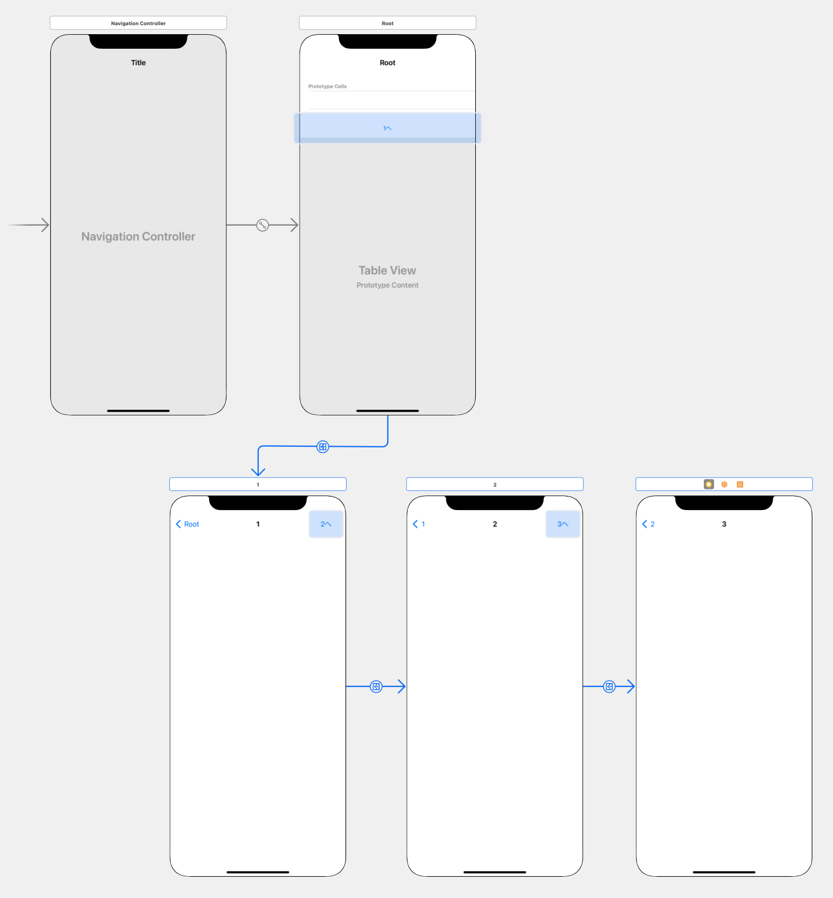

ナビゲーションバーを画面ごとに変更する必要があるアプリを制作したのでやり方のメモです。

`UINavigationController`のextensionとして`UINavigationBarAppearance`を編集するメソッドを実装しました。

## 使用したメソッド

ナビゲーションバーの背景と、ナビゲーションバー上のアイテム（タイトルとか戻るボタンとか）の色を設定できるメソッドを実装しました。

この情報は`UINavigationController`に書き込まれてしまうので、同じ`UINavigationController`上の全てに適用されてしまいます。

そのため、元に戻すためのメソッドも用意しています。

```swift
extension UINavigationController {
    func customColorBar(item: UIColor, background: UIColor) {
        let appearance = UINavigationBarAppearance()
        appearance.configureWithDefaultBackground()
        appearance.backgroundColor = background
        appearance.titleTextAttributes = [.foregroundColor: item]
        appearance.buttonAppearance.normal.titleTextAttributes = [.foregroundColor: item]
        self.navigationBar.tintColor = item
        self.navigationBar.standardAppearance = appearance
        self.navigationBar.scrollEdgeAppearance = appearance
    }
    
    func defaultBar() {
        let appearance = UINavigationBarAppearance()
        appearance.configureWithTransparentBackground()
        self.navigationBar.tintColor = nil
        self.navigationBar.standardAppearance = appearance
        self.navigationBar.scrollEdgeAppearance = appearance
    }
}
```

このメソッドは`ViewController`で以下のように使えます。

```swift
navigationController?.customColorBar(item: .magenta, background: .black)
```

もしくは、AppDelegateなどでUINavigationControllerを生成した際に書き込むことで、起動時に設定することもできます。

詳しく動作を解説します。
```swift
func customColorBar(item: UIColor, background: UIColor) {
    // (iOS13以降のみ使用可能)
    let appearance = UINavigationBarAppearance()

    // 初期化
    appearance.configureWithDefaultBackground()
    // 背景色の設定
    appearance.backgroundColor = background
    // バー中央のタイトルの文字色設定
    appearance.titleTextAttributes = [.foregroundColor: item]
    // バー上のボタン（戻るボタン、右のボタン）の文字色設定
    appearance.buttonAppearance.normal.titleTextAttributes = [.foregroundColor: item]

    // 戻るボタンの矢印はこれでしか設定できない(古い設定方法)
    self.navigationBar.tintColor = item

    // 以下でUINavigationBarAppearance()を適用
    
    // コンテンツをスクロール中のバーの見た目
    self.navigationBar.standardAppearance = appearance
    // スクロールが一番上の時とスクロールがない時のバーの見た目
    self.navigationBar.scrollEdgeAppearance = appearance
    // 横画面で、コンテンツをスクロール中のバーの見た目（nilなら縦画面と同一）
    // self.navigationBar.compactAppearance = appearance
    // 横画面で、スクロールが一番上の時とスクロールがない時のバーの見た目（nilなら縦画面と同一）
    // self.navigationBar.compactScrollEdgeAppearance = appearance
}
```

`UINavigationBarAppearance()`から戻るボタンの矢印の色が変更できずいろいろと苦戦しましたが、部分的に以前の方法を使う形で落ち着きました。

## サンプルアプリ

画面ごとにナビゲーションバーの色を変える簡単なサンプルアプリです。

Storyboard上でNavigationControllerと次の画面へ遷移するボタン(今回はナビゲーションバーの右に置いています)を設定しています。

Storyboard上のナビゲーションバーをクリックして、NavigationItemのtitleを設定しておきます。(今回はRoot, 1, 2, 3にしました。)



ナビゲーションバーの色を変更するメソッドを各ViewControllerに書いていきます。

StoryboardとのViewControllerの紐付けも忘れずに。

画面ごとにバーの色が変わる仕様なら、`viewWillAppear`で色変更メソッドを呼んで、`viewWillDisappear`でデフォルトに戻す実装が良いと思います。

このメソッドは同じ`UINavigationController`に含まれる全ての`ViewController`に適用されてしまうので、`viewWillAppear`でナビゲーションバーの色設定をしない`ViewController`があると前の色のままになってしまいます。(今回は1の画面からRootの画面に戻った場合など）

```swift
class firstViewController: UIViewController {
    override func viewWillAppear(_ animated: Bool) {
        super.viewWillAppear(animated)
        navigationController?.customColorBar(item: .magenta, background: .black)
    }
    
    override func viewWillDisappear(_ animated: Bool) {
        super.viewWillDisappear(animated)
        navigationController?.defaultBar()
    }
}

class secondViewController: UIViewController {
    override func viewWillAppear(_ animated: Bool) {
        super.viewWillAppear(animated)
        navigationController?.customColorBar(item: .yellow, background: .blue)
    }
    
    override func viewWillDisappear(_ animated: Bool) {
        super.viewWillDisappear(animated)
        navigationController?.defaultBar()
    }
}

class thirdViewController: UIViewController {
    override func viewWillAppear(_ animated: Bool) {
        super.viewWillAppear(animated)
        navigationController?.customColorBar(item: .cyan, background: .red)
    }
    
    override func viewWillDisappear(_ animated: Bool) {
        super.viewWillDisappear(animated)
        navigationController?.defaultBar()
    }
}
```


<table>
<td></td>
<td></td>
<td></td>
<td></td>
</table>

お疲れ様でした。